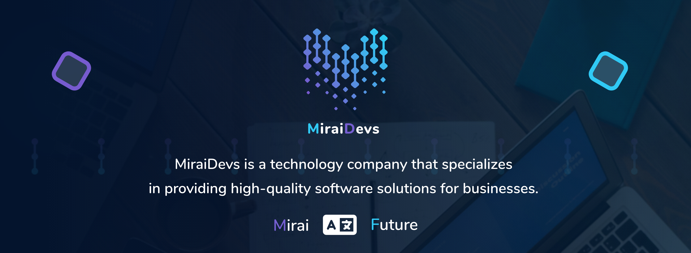

# Mirai Responsive



## MiraiDevs <contact@miraidevs.com>

## Description
MiraiDevs developed the Mirai Responsive Package for Custom Sizes For Any Mobile Device. This package provides a robust solution for creating responsive layouts that automatically adapt to different screen sizes and orientations.

## Installation

1. Add mirai_responsive as a dependency in your pubspec.yaml file.

```yaml
dependencies:
   mirai_responsive: <latest_version>
```

2. Import the mirai_responsive package.

```dart
import 'package:mirai_responsive/mirai_responsive.dart';
```

## Key Features

- Responsive layouts for different screen sizes (mobile, tablet, desktop)
- Automatic orientation handling (portrait and landscape)
- Predefined spacing and sizing system
- Dynamic grid system with automatic column adjustment
- Smooth layout transitions

## Usage

### 1. Basic Setup

Initialize MiraiSize in your main widget using LayoutBuilder for better constraint management:

```dart
class MyHomePage extends StatefulWidget {
  @override
  Widget build(BuildContext context) {
    return Scaffold(
      body: LayoutBuilder(
        builder: (context, constraints) {
          MiraiSize().init(
            constraints: constraints,
          );
          return YourWidget();
        },
      ),
    );
  }
}
```

### 2. Using MiraiResponsive

Create responsive layouts using the MiraiResponsive widget:

```dart
MiraiResponsive(
  mobile: MobileLayout(),              // For screens < 700px
  landscapeMobileLayout: LandscapeLayout(), // For mobile in landscape
  tablet: TabletLayout(),              // For screens 700px - 1200px
  landscapeTabletLayout: TabletLandscapeLayout(), // For tablet in landscape
  desktop: DesktopLayout(),            // For screens >= 1200px
)
```

### 3. Responsive Grid System

The package includes a smart grid system that automatically adjusts columns based on screen width:

```dart
ResponsiveGrid(
  crossAxisCount: MiraiSize.gridCount, // Automatically adjusts based on screen size
)
```

Grid Breakpoints:
- ≤ 380px: 2 columns (small and medium mobile)
- ≤ 500px: 3 columns (normal mobile)
- ≤ 840px: 4 columns (large mobile)
- ≤ 1200px: 5 columns (tablet)
- > 1200px: 6 columns (desktop)

### 4. Predefined Sizes

MiraiSize provides various predefined sizes for consistent spacing and dimensions:

```dart
// Text Sizes
Text(
  'Title',
  style: TextStyle(fontSize: MiraiSize.textSize24),
)

// Spacing
SizedBox(height: MiraiSize.space16)
Padding(padding: EdgeInsets.all(MiraiSize.space20))

// Icon Sizes
Icon(
  Icons.star,
  size: MiraiSize.iconSize32,
)

// Container Sizes
Container(
  height: MiraiSize.containerHeight90,
)

// Border Radius
borderRadius: BorderRadius.circular(MiraiSize.radius8)
```

### 5. Device-Specific Layouts

Create custom layouts for different devices:

```dart
class MobileLayout extends StatelessWidget {
  @override
  Widget build(BuildContext context) {
    return SingleChildScrollView(
      padding: EdgeInsets.all(MiraiSize.space16),
      child: Column(
        children: [
          Text(
            'Mobile Layout',
            style: TextStyle(
              fontSize: MiraiSize.textSize24,
              fontWeight: FontWeight.bold,
            ),
          ),
          // Your mobile-specific content
        ],
      ),
    );
  }
}
```

### 6. Screen Size Categories

MiraiSize automatically detects and adjusts to different device sizes:

- Small Mobile: ≤ 320px
- Medium Mobile: 321px - 380px
- Mobile: 381px - 660px
- Large Mobile: 661px - 840px
- Tablet: 841px - 1200px
- Desktop: > 1200px

### 7. Checking Device Type

You can check the current device type using MiraiResponsive's static methods:

```dart
if (MiraiResponsive.isMobile(context)) {
  // Mobile-specific logic
} else if (MiraiResponsive.isTablet(context)) {
  // Tablet-specific logic
} else if (MiraiResponsive.isDesktop(context)) {
  // Desktop-specific logic
}
```

## Size Categories

MiraiSize provides various size categories that automatically adjust based on screen size:

1. Text Sizes:
   - textSize8 to textSize36

2. Spacing:
   - space2 to space100

3. Container Heights:
   - containerHeight3 to containerHeight500

4. Container Widths:
   - containerWidth2 to containerWidth260

5. Icon Sizes:
   - iconSize10 to iconSize98

6. Border Radius:
   - radius2 to radius50

## Examples

Check out our [example project](https://github.com/devhch/mirai_responsive/tree/master/example) for more detailed implementations and use cases.

## Support

If the Mirai Responsive package matches your needs, please do not hesitate to support the package. I would be very grateful if you buy me a cup of coffee.

<a href="https://www.buymeacoffee.com/miraidevs" target="_blank"></a>

## License

MIT License - see the [LICENSE](LICENSE) file for details